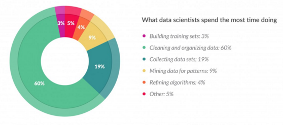
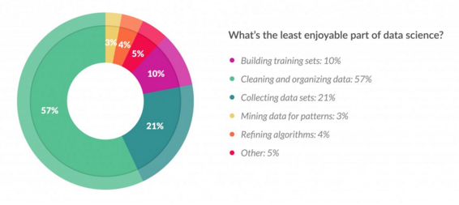
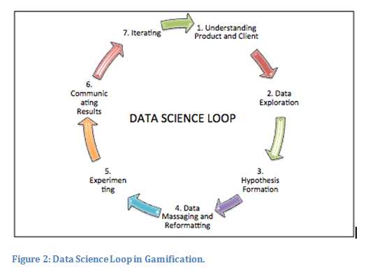

## Materiały

<https://github.com/STWUR/eRementarz3>

## Co robi Data Scientist?

## Czego nie lubi Data Scientist?

## Wielokrotna iteracja

## Ekspolaracyjna analiza danych (EDA)

"Procedures for analyzing data, techniques for interpreting the results of such procedures, ways of planning the gathering of data to make its analysis easier, more precise or more accurate, and all the machinery and results of (mathematical) statistics which apply to analyzing data."

John Tukey

## Brudne dane

> - dane niepełne
> - dane nieprawidłowe
> - dane niespójne
> - duplikaty
> - dane nieintegrujące się

## Podziękowania

Dziękujemy firmie Kruk SA i Wydziałowi Biotechnologii UWr za wspieranie spotkań STWURa.

